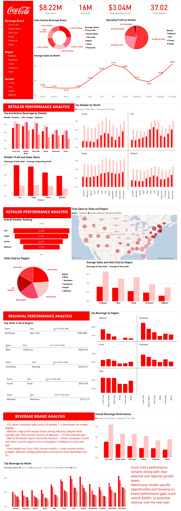

# Coca-Cola Sales Analytics

Tags: Brand Management, Regional Analysis, Retail Performance, Sales Analytics
Tools Used: EXCEL, POWERBI, SQL
Date: January 1, 2026 → January 8, 2026
Project Overview: This project analyzed Coca-Cola's sales data across multiple retailers, regions, and beverage brands to understand revenue drivers, retailer performance, and regional trends. The company needed insights into which retailers generated the most profit, how beverage preferences varied by region, and which sales patterns could inform strategic decisions about product placement, pricing, and regional marketing.
My job was to use SQL to uncover patterns in sales performance, profit margins, and customer behavior across different dimensions. The insights were then used to recommend strategies for optimizing retailer partnerships, improving underperforming regions, and capitalizing on seasonal trends.
Business problem/Problem Statement: Coca-Cola launched a data-driven sales performance initiative. The goal was simple :  uncover what truly fuels growth across retailers, beverage brands, and regions, and to identify where untapped opportunities lie. Using real transactional data from retail partners like Walmart, Target, CVS, and Costco, the project explored:
• Which retailers generate the most revenue and profit
• How beverage preferences differ by region
• What seasonal patterns impact sales performance
• Where potential growth opportunities exist
This analysis would serve as the foundation for smarter marketing campaigns, improved distribution strategies, and more profitable retailer partnerships.
Description of Approach: To help Coca-Cola understand sales performance, retailer partnerships, and regional dynamics, I followed these steps:
1. Collected the Data: Compiled information about sales transactions, retailers, regions, beverage brands, units sold, operating profit, and invoice dates.
2. Cleaned the Data: Verified data integrity, standardized retailer, delivery company and brand names, and ensured date formats were consistent for time-based analysis.
3. Explored the Data: Identified trends like which retailers drive profit, seasonal sales patterns, regional beverage preferences, and performance gaps between top and bottom performers.
4. Exploratory Data Analysis (EDA):Discovered seasonal patterns(Dasani Water sales peaked in warmer months within the South and West), regional beverage preferences, profit drivers, and one rare anomaly; a Walmart order in New Hampshire shipped via DHL and FedEx instead of the usual UPS.
5. Analyzed the Data: Used SQL with window functions, CTEs, and aggregations to calculate totals, averages, rankings, and growth rates. Grouped data by retailer, region, beverage brand, and time periods to reveal actionable insights.
5. Faced Challenges: Managing multiple dimensions (retailer × region × beverage × time) required careful query design. Creating composite rankings and calculating growth opportunities needed weighted scoring to avoid misleading conclusions.
6. Generated Insights: Found that CVS leads in overall performance, Walmart dominates operating profit, Coca-Cola outperforms all other beverages, the West region has the highest unit sales, and summer months (June-August) show the strongest sales.
7. Made Recommendations: Suggested strategies to maximize retailer partnerships, capitalize on regional preferences, optimize seasonal promotions, and close performance gaps for underperforming retailers.
Files & media: coca-cola_analysis.pdf, Coca_Cola_Sales_Dataset.csv, coca_cola.pbix
Status: Done
Data Source: GitHub



SQL QUERIES & INSIGHTS
1. Data Exploration

```sql
-- Quick view of all available data
SELECT *FROM CocaCola_Sales;```
```

This query provides an initial look at the complete dataset to understand available columns, data types, and overall data quality before diving into specific analyses.

 2. RETAILER PERFORMANCE ANALYSIS

 2.1 Top and Bottom Beverage by Retailer

```sql
-- Shows which beverage performs best and worst for each retailer
SELECT   Retailer, Beverage_Brand, sale_volume, av_sales,
     percent_vs_overall,
    CASE
        WHEN bev_rank = 1 THEN 'Top Beverage'
        ELSE 'Bottom Beverage'  END AS ranking
FROM ( SELECT Retailer, Beverage_Brand, 
        SUM(Total_Sales) AS sale_volume, AVG(Total_Sales) AS av_sales,
        RANK() OVER (PARTITION BY Retailer ORDER BY AVG(Total_Sales) DESC) AS bev_rank,
        (AVG(Total_Sales) * 100 / (SELECT AVG(Total_Sales) FROM CocaCola_Sales)) AS percent_vs_overall
    FROM CocaCola_Sales
    GROUP BY Beverage_Brand, Retailer) ranked
WHERE bev_rank = 1 OR bev_rank = 6  
ORDER BY av_sales DESC;
```

Insight: Coca-Cola dominates as the top-performing beverage across key retailers, leading with the highest average sales per retailer CVS (**3,434.18, 156.50% of overall avg**), Walmart (**3,095.23, 141.05%**) with Dasani Water following in Costco (**2,790.09, 127.15%**), and Target (**3,298.54, 150.32%**). This shows consistent overperformance relative to the overall average benchmark.  On the lower end, Fanta consistently ranks as the weakest performer, with significantly lower averages Walmart (**1,227.60, 55.94%**), Costco (**1,726.68, 78.69%**), Target (**2,246.00, 102.35%**), and  CVS identifying Powerade as its lowest performer (**2,280.57, 103.93%**). Overall, the data shows a strong performance gap between leading and underperforming beverages, highlighting clear opportunities for product mix optimization per retailer.

2.2 Retailer Profit and Sales Share

```sql
-- Shows each retailer's contribution to total profit and sales
SELECT Retailer,SUM(Operating_Profit) AS total_profit,
(SUM(Operating_Profit) * 100 / (SELECT SUM(Operating_Profit) FROM CocaCola_Sales)) AS profit_share_percent,
SUM(Total_Sales) AS total_sales,
(SUM(Total_Sales) * 100 / (SELECT SUM(Total_Sales) FROM CocaCola_Sales)) AS sales_share_percent
FROM CocaCola_Sales
GROUP BY Retailer
ORDER BY total_profit DESC;
```

Insight:  Walmart is the clear market leader, contributing **54.19% of total operating profit (1.65M)** and **53.60% of total sales (4.40M)**, showing strong alignment between revenue and profitability. CVS follows with a solid **23.12% profit share (703.33K)** and **25.75% sales share (2.12M)**, indicating slightly higher sales volume but lower efficiency compared to Walmart. Costco contributes **17.82% of profit (542.09K)** and **15.72% of sales (1.29M)**, showing better profit efficiency relative to its sales share. Target is the smallest contributor at **4.86% profit (147.90K)** and **4.92% sales (404.43K)**, reflecting limited market impact across the portfolio.

2.3 Top Retailer by Month

```sql
-- Identifies which retailer had highest average sales each month
SELECT  MONTHS, Retailer,avg_sales, avg_units
FROM ( SELECT  MONTH(Invoice_Date) AS mon, DATENAME(MONTH, Invoice_Date) AS MONTHS,
        Retailer, AVG(Total_Sales) AS avg_sales, AVG(Units_Sold) AS avg_units,
        RANK() OVER (PARTITION BY MONTH(Invoice_Date) ORDER BY AVG(Total_Sales) DESC) AS ranking
    FROM CocaCola_Sales
    GROUP BY Retailer, MONTH(Invoice_Date), DATENAME(MONTH, Invoice_Date) ) ranked
WHERE ranking = 1; 

```

Insight:  Target dominates early-year performance, leading in January–April and again in September–October, with average sales ranging from 2,180.42 to 3,212.50. CVS takes over mid-to-late year dominance, leading in May–August and November–December, with stronger peaks such as July (4,633.67 avg sales, 6,208 units) and June (4,095.77 avg sales, 5,816 units). Overall, the data shows a clear seasonal shift in retail leadership, with Target performing more consistently in the first quarter, while CVS drives higher performance volatility but stronger peaks in the second half of the year.

 2.4 Overall Retailer Ranking

```sql
-- Comprehensive ranking considering both sales and units (total and average)
SELECT  Retailer, total_sales, rank_sum_sales, avg_sales, rank_avg_sales, 
        total_units, rank_sum_units, avg_units, rank_avg_units,
        DENSE_RANK() OVER (ORDER BY totalrank) AS final_rank
FROM (SELECT   Retailer, 
        SUM(Total_Sales) AS total_sales, RANK() OVER (ORDER BY SUM(Total_Sales) DESC) AS rank_sum_sales,
        AVG(Total_Sales) AS avg_sales,   RANK() OVER (ORDER BY AVG(Total_Sales) DESC) AS rank_avg_sales,
        SUM(Units_Sold) AS total_units,  RANK() OVER (ORDER BY SUM(Units_Sold) DESC) AS rank_sum_units,
        AVG(Units_Sold) AS avg_units,    RANK() OVER (ORDER BY AVG(Units_Sold) DESC) AS rank_avg_units,
       (RANK() OVER (ORDER BY SUM(Total_Sales) DESC) + RANK() OVER (ORDER BY AVG(Total_Sales) DESC) +
        RANK() OVER (ORDER BY SUM(Units_Sold) DESC) +  RANK() OVER (ORDER BY AVG(Units_Sold) DESC)) AS totalrank
    FROM CocaCola_Sales
    GROUP BY Retailer) AS done
ORDER BY totalrank;

```

Insight: CVS ranks as the overall best-performing retailer, driven by strong consistency, with **highest average sales (2,938.43 – Rank 1)** and solid performance in total sales (**2.12M – Rank 2**) and units sold (**3.44M – Rank 2**), giving it the strongest combined ranking score. Walmart follows closely as the highest-volume retailer, leading in **total sales (4.40M – Rank 1)** and **total units (9.12M – Rank 1)**, but lower averages (**1,911.43 sales avg – Rank 4**) reduce its overall consistency. Target and Costco show mid-tier performance but in different ways: Target leads in **average units sold (5,697 – Rank 1)** while Costco maintains balanced mid-range performance across all metrics. Overall, the ranking highlights a trade-off between scale (Walmart) and efficiency (CVS).

 2.5 Retailer Growth Opportunity Analysis

```sql
-- Calculates potential revenue if underperforming retailers match top performer

WITH retailer_stats AS 
     (SELECT  Retailer, COUNT(*) AS total_transactions,AVG(Total_Sales) AS avg_sales
      FROM CocaCola_Sales
      GROUP BY Retailer)
SELECT r.Retailer, r.avg_sales AS current_avg_sales,
    (SELECT MAX(avg_sales) FROM retailer_stats) - r.avg_sales AS sales_gap,
    r.total_transactions * ((SELECT MAX(avg_sales) FROM retailer_stats) - r.avg_sales) AS potential_revenue_gain
FROM retailer_stats r
WHERE r.avg_sales < (SELECT MAX(avg_sales) FROM retailer_stats)
ORDER BY potential_revenue_gain DESC;

```

Insight: Walmart presents the highest growth opportunity despite being the largest retailer, with a **sales gap of 1,026.99 per transaction** compared to the top performer and a potential revenue uplift of **2.37M**, driven by its high transaction volume. Costco shows a moderate opportunity with a **696.06 gap per transaction** and potential gain of **400.93K**, while Target has the smallest gap at **129.88**, translating to a limited upside of **18.70K**. Overall, the analysis highlights that the biggest revenue upside lies not in smaller retailers, but in optimizing efficiency within high-volume accounts like Walmart.

 3. REGIONAL PERFORMANCE ANALYSIS

3.1 Top State in Each Region

```sql
-- Identifies best performing state in each region using weighted scoring
SELECT  Region, State, total_sales, avg_sales, total_units, avg_units
FROM ( SELECT  Region, State,
            SUM(Total_Sales) AS total_sales,
            AVG(Total_Sales) AS avg_sales,
            SUM(Units_Sold) AS total_units,
            AVG(Units_Sold) AS avg_units,
            RANK() OVER ( PARTITION BY Region ORDER BY (0.4 * AVG(Total_Sales) +  0.1 * SUM(Total_Sales) +  0.4 * AVG(Units_Sold) +  0.1 * SUM(Units_Sold)) DESC) AS total
    FROM CocaCola_Sales
    GROUP BY Region, State) ranked
WHERE total = 1 
ORDER BY avg_sales DESC;

```

Insight: New York leads the Northeast with **582.69K total sales**, **4,046.43 average sales**, and **1.13M units**, making it the strongest overall state in that region. California tops the West with nearly identical performance at **582.42K total sales** and **4,044.55 average sales**, showing highly competitive regional leadership. In the Southeast, Florida dominates with **561.87K sales** and **1.05M units**, while Texas leads the South with **441.00K sales** and **1.01M units**, showing strong but lower-tier performance compared to coastal regions. Montana leads the Midwest but at a significantly lower scale, with **153.78K sales** and **328K units**, indicating weaker demand concentration. Overall, the data highlights a clear regional imbalance, with coastal states driving significantly higher sales and volume compared to inland regions.

3.2 Top Beverage by Region

```sql
-- Shows which beverage brand performs best in each region
SELECT   Region,  Beverage_Brand, total_sales, avg_sales, total_units, avg_units
FROM ( SELECT  Beverage_Brand,  Region,
        SUM(Total_Sales) AS total_sales, AVG(Total_Sales) AS avg_sales,
        SUM(Units_Sold) AS total_units, AVG(Units_Sold) AS avg_units,
        RANK() OVER (PARTITION BY Region ORDER BY AVG(Total_Sales) DESC) AS ranked_region
    FROM CocaCola_Sales
    GROUP BY Beverage_Brand, Region) ranked 
WHERE ranked_region = 1 
ORDER BY avg_sales DESC;

```

Insight: Coca-Cola dominates regional performance, ranking as the top beverage in the **Southeast (4,470.20 avg sales, 747K units)**, **West (3,461.18, 844.5K units)**, **Northeast (3,193.49, 922.45K units)**, and **Midwest (2,208.60, 811.8K units)**, showing strong and consistent market leadership across most regions.  The only exception is the South, where **Dasani Water leads with 2,790.09 average sales and 551.75K units**, indicating a regional preference shift away from carbonated drinks toward bottled water. Overall, the data shows Coca-Cola’s strong national dominance with a single-region disruption driven by category preference differences.

 4. BEVERAGE BRAND ANALYSIS

 4.1 Top Beverage by Month

```sql
-- Tracks which beverage had highest average sales each month
SELECT  MONTHS, Beverage_Brand, avg_sales
FROM (SELECT  MONTH(Invoice_Date) AS mon,  DATENAME(MONTH, Invoice_Date) AS MONTHS, Beverage_Brand,
        AVG(Total_Sales) AS avg_sales,
        RANK() OVER (PARTITION BY MONTH(Invoice_Date) ORDER BY AVG(Total_Sales) DESC) AS ranking
    FROM CocaCola_Sales
    GROUP BY Beverage_Brand, MONTH(Invoice_Date), DATENAME(MONTH, Invoice_Date) ) ranked
WHERE ranking = 1;  

```

Insight: Coca-Cola dominates monthly performance for most of the year, leading in **10 out of 12 months**, with strong peaks in **July (4,290.21 avg sales)**, **August (4,195.35)** , and **December (4,288.12)** , showing strong seasonal demand during mid-year and year-end periods. Dasani Water breaks Coca-Cola’s dominance in **June (3,820.08 avg sales)** and **November (3,307.81)**, indicating seasonal shifts where bottled water demand spikes, likely due to weather or consumption behavior changes. Overall, the data highlights strong brand consistency for Coca-Cola with limited but notable seasonal disruptions from Dasani Water.

4.2 Overall Beverage Performance

```sql
-- Summary metrics for each beverage brand
SELECT Beverage_Brand, total_sales, avg_sales, total_units,avg_units
FROM (SELECT Beverage_Brand,
        SUM(Total_Sales) AS total_sales, AVG(Total_Sales) AS avg_sales,
        SUM(Units_Sold) AS total_units, AVG(Units_Sold) AS avg_units,
        RANK() OVER (PARTITION BY Beverage_Brand ORDER BY AVG(Total_Sales) DESC) AS totalll
    FROM CocaCola_Sales
    GROUP BY Beverage_Brand) ranked
WHERE totalll = 1
ORDER BY avg_sales DESC;

```

Insight: Coca-Cola is the top-performing beverage overall, generating **1.92M in total sales**, with the highest average sales per transaction at **3,081.94** and leading unit sales of **3.99M**. Dasani Water ranks second with **1.64M total sales** and **2,626.81 average sales**, showing strong demand but lower value per transaction compared to Coca-Cola. Diet Coke, Sprite, and Powerade form the mid-tier cluster, with relatively similar performance levels, while Fanta is the weakest performer at **969.98K total sales** and the lowest average sales of **1,554.45**, indicating consistent underperformance across the portfolio. Overall, the data shows a clear tiered structure: Coca-Cola as the dominant driver, Dasani as a strong secondary product, and Fanta as the key optimization opportunity.

 4.3 Month-over-Month Sales Growth

```sql
-- Calculates sales growth rate between consecutive months
SELECT   MONTH(Invoice_Date) AS month_num, DATENAME(MONTH, Invoice_Date) AS month_name, SUM(Total_Sales) AS total_sales,
        LAG(SUM(Total_Sales)) OVER (ORDER BY MONTH(Invoice_Date)) AS prev_month_sales,
        ROUND(  ((SUM(Total_Sales) - LAG(SUM(Total_Sales)) OVER (ORDER BY MONTH(Invoice_Date))) 
        / NULLIF(LAG(SUM(Total_Sales)) OVER (ORDER BY MONTH(Invoice_Date)), 0)) * 100, 
        2 ) AS mom_growth_percent
FROM CocaCola_Sales
GROUP BY MONTH(Invoice_Date), DATENAME(MONTH, Invoice_Date) 
ORDER BY MONTH(Invoice_Date);
```

Insight: Sales show a volatile but strongly seasonal pattern across the year. After a slight decline from **January to March (-5.19% and -1.28%)**, performance rebounds in **April (+1.96%)**, followed by a sharp growth phase starting in **May (+37.33%) and June (+30.93%)**, peaking again in **July (+15.00%)**. A mid-year dip occurs in **August (-8.37%) and September (-26.72%)**, before recovery in **November (+26.52%) and a strong year-end surge in December (+30.71%)**, the highest monthly sales period at **984.74K**. Overall, the trend highlights strong **seasonal demand cycles**, with peak performance concentrated in mid-year and year-end months, and predictable slowdowns in early and late Q3.

## Recommendations

### 1. Strengthen High-Performing Retailers (Walmart & CVS)

- Walmart drives over **53% of total sales and profit**, making it the most critical revenue channel.
- Focus on **exclusive promotions, shelf priority, and long-term contracts** to protect this dominance.
- CVS shows strong efficiency and consistency—leverage it as a **premium performance benchmark retailer**.

### 2. Fix Underperforming Products (Especially Fanta & Powerade)

- Fanta consistently ranks as the weakest performer across retailers and regions.
- Powerade also underperforms in key accounts.
- Recommendation:
    - Reposition these products (bundling, discount campaigns, targeted promotions)
    - Or reduce shelf space in low-performing locations to improve profitability efficiency

### 3. Optimize Regional Strategy

- Strong performance clusters in **coastal states (California, New York, Florida)**.
- Midwest shows weaker demand and lower sales volume.
- Recommendation:
    - Increase targeted marketing and distribution efficiency in underperforming inland regions
    - Replicate successful coastal strategies in weaker markets

### 4. Leverage Seasonal Demand Patterns

- Sales peak significantly in **May–July and November–December**.
- Clear dips occur in **Q1 and parts of Q3**.
- Recommendation:
    - Scale up marketing spend and inventory before peak seasons
    - Use promotional campaigns to stabilize low-performing months

### 5. Strengthen Portfolio Balance

- Coca-Cola dominates heavily, while Dasani is the only strong secondary performer.
- Mid-tier products (Diet Coke, Sprite, Powerade) show stable but non-dominant performance.
- Recommendation:
    - Focus innovation and marketing efforts on mid-tier products to reduce dependency on Coca-Cola
    - Improve product differentiation strategies within the portfolio

### 6. Improve Retailer Efficiency (Not Just Scale)

- Walmart leads in volume but has lower efficiency (average performance).
- CVS shows stronger efficiency despite lower scale.
- Recommendation:
    - Balance strategy between **high-volume expansion (Walmart)** and **high-efficiency growth (CVS)**
    - Use performance benchmarking to identify inefficiencies in large accounts

### 7. **Logistics and Delivery Insights**

That single DHL/FedEx delivery exception while minor  signals that logistics data should be continuously monitored. Regular checks ensure operational consistency and help detect early signs of supply chain irregularities.

### Conclusion

This analysis provides a clear, data-driven view of Coca-Cola’s sales ecosystem across retailers, regions, and beverage brands. The results show a highly **concentrated performance structure**, where a few key players especially Walmart at the retailer level and Coca-Cola at the brand level—drive the majority of sales and profit outcomes.

The data also highlights strong **seasonal patterns**, with noticeable growth spikes in mid-year and year-end periods, and predictable slowdowns in early and late Q3. At the same time, performance varies significantly by geography, with coastal states and certain regions consistently outperforming others.

Overall, the business operates with strong brand dominance but uneven performance distribution across products and channels, revealing clear opportunities for optimization and growth. 
